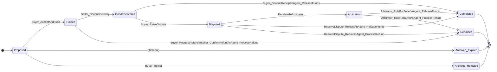

# Canton Escrow Service: Workflows & State Transitions

This document outlines the complete lifecycle of an escrow agreement, from creation to completion, including dispute resolution and arbitration. Understanding these flows is crucial for integrating with the service and for auditing the on-ledger contracts.

## Parties

There are three primary parties involved in every escrow agreement, with an optional fourth for arbitration.

*   **Seller**: The party providing goods or services. The Seller initiates the escrow agreement.
*   **Buyer**: The party purchasing the goods or services. The Buyer funds the escrow.
*   **Escrow Agent**: A neutral third party responsible for holding the funds and releasing or refunding them according to the agreement's rules. They are the ultimate custodian of the funds during the escrow period.
*   **Arbitrator**: An optional, neutral party designated to resolve disputes if the Buyer and Seller cannot reach an agreement.

## Escrow Agreement States

An escrow contract moves through a series of states, represented by different Daml templates or by a status field within a single template. Each state transition is triggered by a choice exercised by one of the authorized parties.

*   `Proposed`: The initial state. The Seller has created the agreement terms, but the Buyer has not yet accepted.
*   `Funded`: The Buyer has accepted the terms and deposited the required funds with the Escrow Agent. The contract is now active.
*   `GoodsDelivered`: The Seller has marked the goods or services as delivered. Awaiting confirmation from the Buyer.
*   `Disputed`: The Buyer has contested the transaction after the Seller marked it as delivered. This freezes the funds pending resolution.
*   `Completed`: The happy path conclusion. The Buyer has confirmed receipt, and the Escrow Agent has released the funds to the Seller. The contract is archived.
*   `Refunded`: The transaction was canceled, and the Escrow Agent has returned the funds to the Buyer. The contract is archived.
*   `Arbitration`: A dispute could not be resolved between the Buyer and Seller and has been escalated to a designated Arbitrator.

## State Transition Diagram

The following diagram illustrates the lifecycle of an escrow contract.

## Core Workflows

### 1. Happy Path: Successful Transaction

This is the ideal flow where both parties are satisfied.

1.  **Proposal**: The `Seller` creates an `EscrowProposal` contract, detailing the item, price, `Buyer`, `EscrowAgent`, and an optional `Arbitrator`.
2.  **Accept & Fund**: The `Buyer` exercises the `Buyer_AcceptAndFund` choice on the `EscrowProposal`. This is a multi-step atomic transaction:
    *   The `Buyer` transfers the required funds to the `EscrowAgent` (e.g., via a DVP instruction against a token).
    *   The `EscrowProposal` is consumed.
    *   An active `EscrowAgreement` contract is created in the `Funded` state, visible to `Buyer`, `Seller`, and `EscrowAgent`.
3.  **Confirm Delivery**: The `Seller` ships the goods or provides the service and exercises the `Seller_ConfirmDelivery` choice on the `EscrowAgreement`.
    *   The contract transitions to the `GoodsDelivered` state.
4.  **Confirm Receipt**: The `Buyer` receives the item, is satisfied, and exercises the `Buyer_ConfirmReceipt` choice.
5.  **Release Funds**: The `EscrowAgent` is now authorized to release the funds. They exercise `Agent_ReleaseFunds`.
    *   The agent transfers the funds from their holding account to the `Seller`.
    *   The `EscrowAgreement` contract is archived, moving it to the `Completed` state.

### 2. Refund Before Delivery

This flow occurs if the Buyer cancels the order before the Seller has shipped the goods.

1.  **Proposal & Funding**: Steps 1 & 2 from the Happy Path are completed. The contract is `Funded`.
2.  **Request Refund**: The `Buyer` exercises `Buyer_RequestRefund`. This creates a `RefundProposal` contract, making the Seller aware of the request. The main `EscrowAgreement` remains active.
3.  **Confirm Refund**: The `Seller` agrees and exercises `Seller_ConfirmRefund` on the `RefundProposal`.
4.  **Process Refund**: The `EscrowAgent` is now authorized to refund the Buyer. They exercise `Agent_ProcessRefund`.
    *   The agent transfers the funds back to the `Buyer`.
    *   Both the `RefundProposal` and the `EscrowAgreement` are archived. The process concludes in the `Refunded` state.

### 3. Dispute After Delivery

This flow occurs if the Buyer is not satisfied with the delivered goods or services.

1.  **Proposal, Funding, Delivery**: Steps 1-3 from the Happy Path are completed. The contract is in the `GoodsDelivered` state.
2.  **Raise Dispute**: The `Buyer` exercises `Buyer_RaiseDispute`, providing a reason.
    *   The `EscrowAgreement` contract transitions to the `Disputed` state. Funds are now locked and cannot be released or refunded without resolving the dispute.
3.  **Resolution (Off-Ledger Negotiation)**: The `Buyer` and `Seller` communicate off-ledger to reach an agreement. The Daml model facilitates the on-ledger settlement of their agreement.
4.  **Settle Dispute**: Once an agreement is reached, one of two choices can be exercised by joint authorization of Buyer and Seller:
    *   `ResolveDispute_Release`: If they agree to proceed with the sale.
    *   `ResolveDispute_Refund`: If they agree on a full or partial refund.
5.  **Agent Action**: Based on the resolution choice, the `EscrowAgent` is authorized to exercise either `Agent_ReleaseFunds` or `Agent_ProcessRefund`, finalizing the transaction and archiving the contract.

### 4. Arbitration Flow

This is the final escalation path if the Buyer and Seller cannot resolve a dispute themselves.

1.  **Dispute Raised**: The contract is in the `Disputed` state.
2.  **Escalate**: Either the `Buyer` or the `Seller` exercises the `EscalateToArbitration` choice.
    *   The contract's state transitions to `Arbitration`.
    *   The designated `Arbitrator` is notified (becomes an observer on the contract).
3.  **Arbitration (Off-Ledger Process)**: The `Arbitrator` reviews evidence from both parties. This process happens outside the ledger.
4.  **Make Ruling**: The `Arbitrator` makes a binding decision and exercises a choice on the `EscrowAgreement` contract, for example:
    *   `Arbitrator_RuleForSeller`: Rules in favor of the Seller.
    *   `Arbitrator_RuleForBuyer`: Rules in favor of the Buyer.
    *   `Arbitrator_RuleWithSplit(sellerAmount, buyerAmount)`: Rules for a specific split of the funds.
5.  **Agent Executes Ruling**: The `EscrowAgent` is now authorized to act based on the arbitrator's ruling. They exercise the corresponding choice (`Agent_ReleaseFunds`, `Agent_ProcessRefund`, or `Agent_ProcessSplit`), which transfers the funds accordingly and archives the contract.